

  

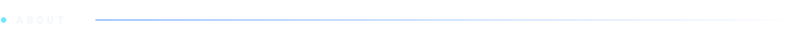

I'm a software engineering student who builds technically ambitious systems: peer-to-peer communication, distributed resource meshes and the networking underneath them. 
I like to understand how something should work before I write the code.

  

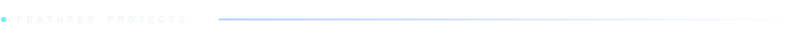

  
  

  <a href="https://github.com/uzairumar1029-creator/Mall-Management-System">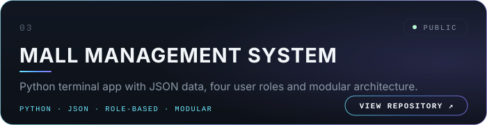</a>

  
  

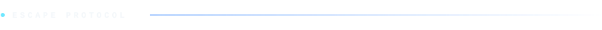

  

Every cell above is a real day of activity. Contributions become power; the explorer runs, collects, fights or escapes on its own. Regenerated automatically.

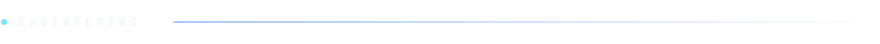

  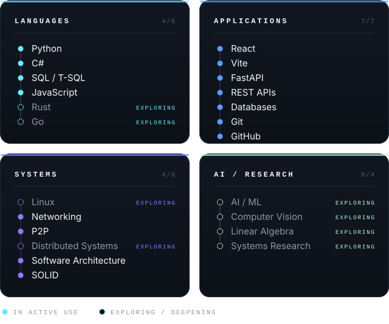

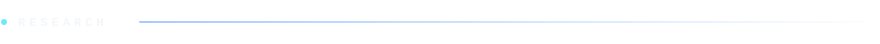

  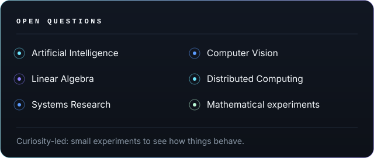

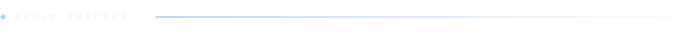

  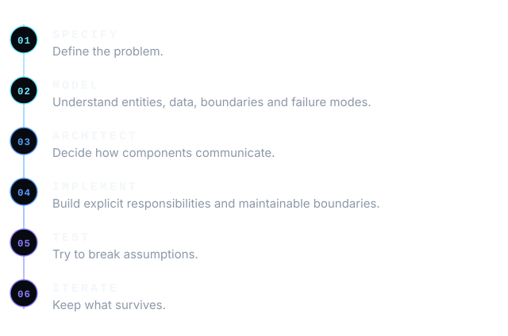

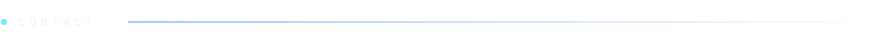

  
  
  
  
  
  

  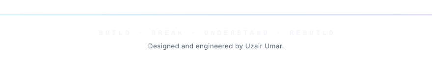

